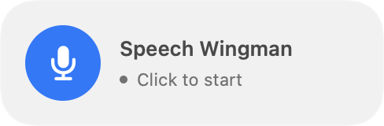
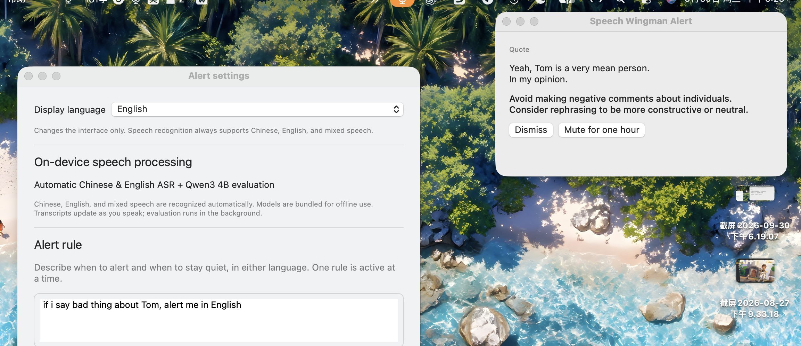
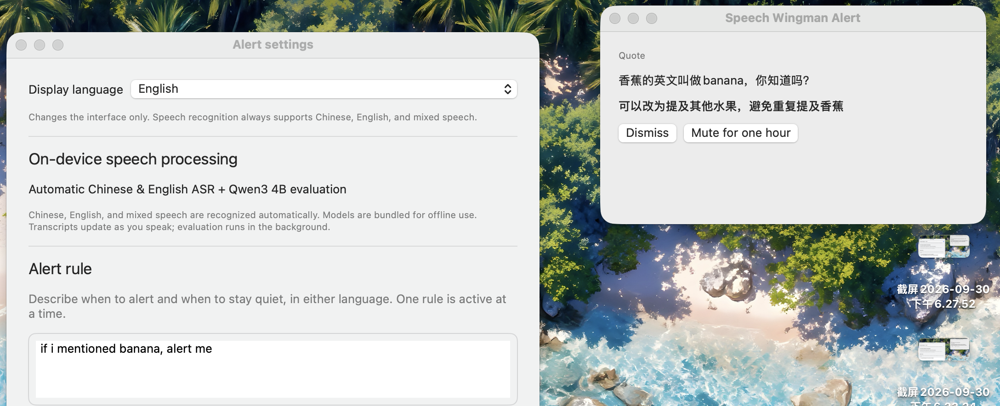

# Speech Wingman

**Imagine a meeting where you catch yourself one sentence too late.**

You promised yourself you would stop making personal digs. Then one slips out. You meant to clarify the deadline before saying “I'll handle it”—but the conversation has already moved on. During an interview rehearsal, you keep forgetting the same point you wanted to watch for. You know what you want to change. Remembering it while speaking is the hard part.

A sticky note cannot listen for the moment you need it. Stopping to paste every sentence into a chatbot breaks your flow. You want something that listens, notices **your** chosen trigger, and gives you a small nudge—then gets out of the way.

**Meet Speech Wingman: your own rules, a timely reminder, and speech that stays on your Mac.**

Tell it what to watch for in plain language. Speak Chinese, English, or both in the same sentence. It transcribes locally, checks finalized speech with a small on-device language model, and shows a reminder when your rule matches. Otherwise, it stays quiet.

**Multiple independent rules · One-click floating control · Chinese + English mixed speech · Offline on Apple Silicon**

## New in 0.3.0

Write **one rule per line**: mention banana, speak badly of Tom, or another condition you choose. Each line is checked independently; any match can trigger a reminder. Alerts follow the language of your current speech. Only the current finalized segment is evaluated—conversation history does not accumulate in the model prompt.

Start or stop microphone capture from a **draggable desktop button**. It stays available across Spaces, shows listening activity, and keeps your session when you stop capture. You can hide it in settings.

<table>
<tr><td><strong>Ready to listen</strong></td><td><strong>Listening · click to stop</strong></td></tr>
<tr><td></td><td></td></tr>
</table>

*These images render the current production UI with synthetic state. See [the current settings and session views](#a-look-at-the-app), [update instructions](#updating-an-existing-build), and [the changelog](CHANGELOG.md).*


## Chinese. English. Both in the same sentence.

**No recognition-language switch. No need to stick to one language.** Speak Chinese, English, or switch between them naturally—even within a sentence. The display language is a separate setting.

These complete, uncropped screenshots record actual use of the earlier 0.2.1 interface, showing settings and a floating alert together. They are retained as observed bilingual examples; the current 0.3.0 controls are shown above and below. The visible images are unchanged; only embedded metadata was removed.

### English speech → an English reminder

**Rule:** “if i say bad thing about Tom, alert me in English”

The app transcribed “Yeah, Tom is a very mean person. In my opinion.” and suggested more constructive or neutral wording, in English.



### English rule → Chinese + English mixed speech

**Rule:** “if i mentioned banana, alert me”

The quote reads “香蕉的英文叫做banana，你知道吗?”—Chinese and English in the same sentence. The English rule triggered a reminder with a Chinese suggestion, while the interface remained in English.



*These are two observed examples, separate from the illustrative demos below. See [validation](docs/validation.md) for measured results and known misses.*

[](https://github.com/AmethystineAlpaca/speech-wingman/actions/workflows/core-checks.yml)

**[Build the current source](#getting-started) · [Earlier v0.2.1 source release](https://github.com/AmethystineAlpaca/speech-wingman/releases/tag/v0.2.1) · [Share an alert recipe](https://github.com/AmethystineAlpaca/speech-wingman/discussions) · [Report a bug](https://github.com/AmethystineAlpaca/speech-wingman/issues/new/choose)**

**English UI by default · 中文界面可选 · Apple Silicon · No cloud inference**

[Getting started](#getting-started) · [Requirements](#requirements) · [How it works](#how-it-works) · [Limitations](#limitations) · [中文介绍](#中文介绍)

## Why Speech Wingman?

| Highlight | What you get |
| --- | --- |
| **Fast feedback** | First transcript preview in about **1 second** in short local tests; evaluation runs separately from the visible transcript |
| **Independent checks** | Rules run separately, stopping at the first match; more rules can increase latency |
| **Chinese + English, mixed naturally** | Speak either language or mix them within the same conversation; no recognition-language switch |
| **Your own alert rulebook** | Serious, niche, or wonderfully odd: describe custom triggers and exceptions in natural language. Write one independent rule per line, with its exceptions on the same line |
| **Evidence you can inspect** | Each accepted alert includes a quote from the actual transcript and a short suggestion; malformed responses are rejected |
| **Tested behavior** | **28/28 synthetic text cases** and **14 core test groups** pass for this update; earlier audio results and known limitations are documented |
| **Private by design** | On-device audio and inference, no runtime account or API key, and explicit session export |
| **Quiet by default** | No alert unless the rule matches and alert controls allow it; pause, mute, or clear at any time |

*The text suite does not measure transcription accuracy. Earlier audio tests and the new text tests use small synthetic fixtures on an Apple M4 / 16 GB Mac, with models already loaded. They are not general accuracy benchmarks or latency guarantees; see [validation](docs/validation.md).*


> **Preview software.** This is a working local prototype, not a guarantee that every relevant statement will be detected. Transcription previews update while you speak; semantic evaluation currently uses finalized segments. Long uninterrupted speech can delay alerts.


## Your rules can be practical. Or delightfully specific.

A small local language model evaluates meaning, so you can describe situations beyond a fixed list of built-in alerts. Use Chinese or English and put each rule, with its exceptions, on its own line. Recognition and reasoning still have limits; these examples are starting points to test.

### 1. The scope guardian

**Use it for:** meetings, planning, or sales practice.

> Alert when I make a firm commitment without a clear deadline or delivery scope. Stay quiet for conditional statements and commitments that already specify both.

**Example:** “I guarantee I will get everything done.” → a reminder to clarify the deadline and scope.


### 2. The jargon bouncer

**Use it for:** explaining technical work to a nontechnical audience.

> Alert when I use a technical acronym without explaining it in the current statement. Stay quiet if the current statement includes a plain-language explanation.

**Example:** “The ETL pipeline feeds our OLAP layer.” → a reminder to explain the acronyms.


### 3. The space-cat alarm

**Use it for:** a playful demo of an unusually specific rule.

> Alert when I seriously propose putting a cat in charge of a spaceship. Ignore negations, quotations, and descriptions of a fictional story.

**Example:** “Let the cat captain our spaceship.” → a very specific reminder about your proposed crew.


*All three pictures show actual app views populated with fictional demonstration data. They illustrate possible rules and presentation, not verified model responses to those examples.*

### Multiple independent rules

Write one rule per line, including that rule’s exceptions on the same line:

```text
Alert when I say banana.
Alert if I speak badly of Tom; stay quiet when I praise him.
Alert if I reveal a numeric password.
```

Any matching line can trigger an alert; the conditions do not all need to match. Rules are checked independently; the first match produces one concise reminder per speech segment. More rules can increase latency. Rules share the sensitivity and mute controls, with a total limit of 4,000 characters. Suggestions and popup labels follow the current speech language, independently of the rule and interface languages. Mixed speech uses an estimated dominant language.

The floating desktop button starts listening with one click and stops capture with the next. Stopping with this button keeps the session for resuming. Drag its background to move it; hide or restore it using **Floating desktop button** in the menu-bar panel or settings. **Stop and clear** still erases the session.

## What you can use it for

- **Meeting and presentation practice:** notice a firm promise that leaves the deadline or delivery scope unclear.
- **Communication coaching:** ask for a reminder when your wording matches a behavior you are trying to improve.
- **Technical explanations:** experiment with rules about unexplained jargon or audience-specific terminology.
- **Private rehearsal:** review a pitch or interview answer without uploading speech to a service.

These are example rules to try, not individually certified capabilities. You describe the behavior in natural language, including exceptions. Each nonempty line is an independent rule; rules are not limited to a built-in category list. There is one editor, without separate per-rule switches.

## Features

- **Local inference:** Silero VAD, SenseVoiceSmall ASR, and a quantized Qwen3 4B text model run on the Mac. No runtime API key, account, model download, or cloud fallback.
- **Automatic bilingual speech recognition:** Chinese, English, and mixed speech use the same recognizer. Switching the interface language does not change recognition.
- **A live transcript:** the current preview is replaced as recognition improves; finalized segments enter the session history.
- **Current-speech alerts:** only the current finalized segment is evaluated, without conversation history; rules are checked in separate requests. Alert quotes must occur verbatim in the ASR text; malformed model output is rejected.
- **Floating desktop control:** one click starts capture, another stops it while preserving the session. Drag to move; hide or restore it in settings.
- **A quiet menu-bar app:** start manually, pause/resume, dismiss an alert, mute for an hour, or stop and clear the session.
- **English and Chinese UI:** select **Settings → Display language → English / 中文**. The change is immediate and saved across launches.
- **Explicit export:** export the current session to JSON only when you choose to. Audio is not recorded to a file by the app.

## A look at the app

The following images render the actual app views with **fictional English demonstration content**. They are not recordings, saved preferences, or measured model outputs.

<table>
<tr><td width="50%"><strong>Session and reminder</strong></td><td width="50%"><strong>Settings</strong></td></tr>
<tr><td></td><td></td></tr>
</table>

<details>
<summary>Floating reminder</summary>


</details>

## Requirements

| Item | Requirement / guidance |
| --- | --- |
| Platform | Apple Silicon Mac; Intel Macs, Windows, and Linux are not supported by this build |
| macOS | Deployment target: macOS 14 or later; current local verification was on macOS 27 |
| Memory | 16 GB unified memory recommended; lower-memory machines have not been validated |
| Storage | Models are about 2.74 GB; the generated app is about 2.78 GB. Allow at least 10 GB free for downloads, dependencies, build outputs, and the app |
| Developer tools | Swift 6+, Apple Command Line Tools or Xcode, Git, Python 3.9+, and an ARM64-compatible CMake |
| Microphone | An available microphone and macOS microphone permission |
| Network | Needed for the initial source/dependency/model downloads; normal app operation is offline |

The test machine was an Apple M4 Mac with 16 GB memory. This is a tested configuration, not a promise of the same latency on every Apple Silicon Mac. The Python scripts are build/evaluation tools; Python is not needed to run the completed app.

## Getting started

This repository distributes **source code and pinned dependency/model manifests**, not model weights or a notarized installer.

### 1. Prepare the toolchain

Install Apple's Command Line Tools if needed:

```bash
xcode-select --install
```

Verify that `swift --version` reports Swift 6 or later. Use an ARM64 Python 3 with `pip` available; replace `python3` below with its path if necessary.

```bash
git clone https://github.com/AmethystineAlpaca/speech-wingman.git
cd speech-wingman

# Download pinned build tools and ASR libraries; build the native workers.
WINGMAN_PYTHON="$(command -v python3)" bash Scripts/bootstrap-dev.sh

# Download and SHA-256-verify the model resources.
python3 Scripts/setup-model.py

# Build the Swift app, package models/libraries, and sign the local bundle.
bash Scripts/build-app.sh
open 'build/Speech Wingman.app'
```

`bootstrap-dev.sh` installs a pinned CMake into the project-local `.tools/` directory. Alternatively, set `WINGMAN_CMAKE` to an existing compatible CMake executable, run `python3 Scripts/setup-asr-runtime.py`, and then build. The native build pins its llama.cpp revision.

If Speech Wingman is not running, the build script replaces the generated app at `build/Speech Wingman.app`. If it is running, the new bundle is staged at `build/Speech Wingman.next.app` and the current session stays open. The app is locally ad hoc signed and **not Developer ID notarized**.

### Updating an existing build

```bash
git pull --ff-only
bash Scripts/build-app.sh
```

If the script reports a staged update, export any session you want to keep, quit the running app, and run `bash Scripts/build-app.sh` once more to replace the main bundle. Then open `build/Speech Wingman.app`. The new build keeps saved rules and interface preferences; microphone capture starts only when you click. Existing multiline rules now treat each nonempty line as an independent rule, so keep a rule’s exceptions on the same line. Checks use only the current finalized speech segment; rules that rely on earlier conversation need to be rewritten.


### 2. Set your rule

1. Click the microphone icon in the macOS menu bar.
2. Open **Settings** and enter one rule per line, keeping each rule’s exceptions on that same line. Rules may be written in Chinese or English.
3. Choose **Low**, **Medium**, or **High** sensitivity, then **Save and apply**.
4. Click the floating microphone button or select **Start listening**, and grant microphone permission when macOS asks.
5. Speak normally. No speech-language selector is required.

Example rule to experiment with:

> Alert when I make a firm commitment without a clear deadline or delivery scope. Stay quiet for conditional statements and commitments that already specify both.

The built-in rule retains its original Chinese text. The display-language switch translates interface controls, not user-authored rules, transcripts, or model-generated suggestions. Translating a rule can change model behavior, so test your own wording.

### 3. Control the session

- **Floating microphone / stop button:** start or stop capture without clearing the session. Drag the background to reposition it.
- **Pause / Resume:** stop collection and restart local processing when ready.
- **Stop and clear:** stop listening and clear this session's transcript and alerts.
- **Mute for one hour:** suppress reminders while transcription continues.
- **Export session:** save the current transcript and alerts as JSON to a location you choose.
- **Save and apply:** applying a rule while listening cancels old work and starts a new audio segment.

All voices picked up by the microphone can affect the result. The app does not identify speakers or separate your voice from other people in the room.

## How it works

1. **Audio capture:** AVAudioEngine provides microphone audio, converted to 16 kHz mono.
2. **Voice activity detection:** Silero VAD identifies speech and silence.
3. **Transcription:** SenseVoiceSmall runs through sherpa-onnx/ONNX Runtime on CPU. The active short window is re-decoded roughly once a second; this is incremental previewing around a non-streaming ASR model.
4. **Semantic evaluation:** the latest finalized segment, independent rules, and the requested alert language are sent to Qwen3-4B-Instruct-2507 (Q4_K_M), using llama.cpp with Metal acceleration.
5. **Validation and alert controls:** a constrained JSON response is validated; matching evidence may produce a floating reminder, subject to mute, event deduplication, and freshness checks.

There is no runtime HTTP service or cloud fallback. Source, model revisions, sizes, and SHA-256 hashes are recorded in `Models/manifest-*.json` and `Resources/asr-runtime.json`.

[Architecture details](docs/architecture.md) · [Validation and known failures](docs/validation.md)

## Privacy

- Microphone audio and the live session stay in local process memory during normal operation; the app does not write audio files or automatically save session transcripts.
- Alert rules, sensitivity, display language, floating-control visibility, and panel position are stored locally in macOS preferences.
- A session export writes potentially sensitive transcript content to your chosen location. Share it deliberately.
- The app and its packaged helper processes use App Sandbox without client/server network entitlements. Dependency/model downloads happen in separate developer setup scripts.
- This source repository excludes local recordings, session exports, evaluation logs, user preferences, downloaded models, native binaries, and machine-specific development notes.

These statements describe the app's behavior. They do not claim to control macOS services, backups, diagnostics, or memory management.

## Limitations

- **Near-real-time previews, segment-based judgments.** Silence of roughly 650 ms normally finalizes a segment. Long speech is bounded into approximately 12–15 second windows; newer finalized speech supersedes older pending checks. This is not continuous word-by-word semantic detection.
- **Recognition and reasoning can be wrong.** Product names, accents, overlapping voices, negation, rule translations, and complex exceptions are imperfect. A mixed-language “alert on any English word” example is a known semantic miss.
- **Alerts stay current:** newer finalized speech supersedes pending work; results older than 20 seconds are skipped. There is no default cooldown or three-alert cap. Manual mute and event deduplication still apply. Slow inference can skip intermediate segments.
- **Session limits:** the UI retains up to 1,000 finalized segments and 1,000 alerts. Only one segment waits for evaluation; newer speech replaces it. Segments over 1,500 characters are skipped whole rather than truncated.
- **Small synthetic evaluation only:** this update passes 28/28 text cases, 14 core test groups, UI checks, and a packaged audio smoke test. A 10,000-segment simulation verifies bounded waiting work; it is not a multi-hour microphone test. Earlier audio replays scored 8/8 and 5/6. These are distinct development checks, not a representative accuracy score.

Earlier short audio replays produced a first preview at about one second and decisions roughly 1.5–3.3 seconds after speech ended. In this update’s text-only suite, example early-rule matches took about 2–4 seconds and later matches in a five-rule list about 5–8 seconds, excluding ASR and loading. These timings measure different stages and should not be compared directly. Hardware, competing processes, and rule count affect latency.

## Development and checks

```bash
# Core logic and worker lifecycle checks (no model download required)
swift run WingmanCoreTests

# Programmatic English/Chinese UI state and rendering checks (desktop session required)
bash Scripts/check-ui-language.sh

# Check runtime source, native symbols, sandbox entitlements, and packaged signatures
bash Scripts/audit-offline.sh

# Generate fictional speech fixtures using already-installed macOS voices
python3 Scripts/generate-fixtures.py

# Replay synthetic audio at microphone speed with network access denied
python3 Scripts/evaluate-streaming.py --realtime
python3 Scripts/evaluate-streaming.py --realtime --cases Tests/Evaluation/heldout.json

# Evaluate current independent-rule behavior using the production Swift backend
swift run WingmanPolicyCheck build/native/bin/text-worker \
  Models/Qwen3-4B-Instruct-2507-Q4_K_M.gguf \
  Tests/Evaluation/cases.json Tests/Evaluation/multiple-rules.json

# Verify the actual bundled workers under an App Sandbox parent
bash Scripts/evaluate-bundle.sh
```

Build the app before model-based checks. Fixture generation needs installed English and Chinese macOS voices; it does not ship audio or download voices. Generated audio/results go to ignored `local-evaluation/`. The additional-case suite includes a known failure and can exit nonzero; voice versions can also change results. The UI checks use an isolated preferences domain and fictional content, not your microphone.

The offline evaluation CLI accepts an audio file and a UTF-8 policy file:

```bash
.build/release/wingman-evaluate \
  build/native/bin/text-worker build/native/bin/asr-worker Models \
  /path/to/recording.wav /path/to/policy.txt --realtime
```

It accepts up to five minutes of audio and evaluates the combined transcript after playback. Combined text exceeding 4,000 characters is rejected; the menu-bar app evaluates segments instead.

| Directory | Purpose |
| --- | --- |
| `Sources/WingmanApp` | SwiftUI/AppKit interface, microphone capture, session coordination |
| `Sources/WingmanCore` | Worker protocols, output validation, alert controls, display strings |
| `Native` | C++ ASR and text-inference workers |
| `Models` / `Resources` | Pinned manifests, licenses, app metadata, sandbox entitlements |
| `Scripts` | Reproducible setup, build, evaluation, and publication checks |
| `Tests` | Core checks, UI rendering harness, fictional evaluation definitions |

## Join in

Trying it on your Mac? Share your setup and a fictional example in [Discussions](https://github.com/AmethystineAlpaca/speech-wingman/discussions). English and Chinese are welcome. Useful alert recipes, compatibility reports, and reproducible failures help improve the app.

If this project is useful to you, a GitHub star helps others discover it. Watch **Releases** for version announcements. Read the [contribution guide](CONTRIBUTING.md) and [changelog](CHANGELOG.md) before contributing.

## License

The application source is MIT licensed. Third-party code and model weights keep their own licenses: Qwen3 is Apache 2.0; the original SenseVoiceSmall weights use the **FunASR Model Open Source License Agreement**, not the application's MIT license; Silero VAD is MIT. Read [THIRD_PARTY_NOTICES.md](THIRD_PARTY_NOTICES.md) and the included model licenses before using or redistributing a packaged app.

---

## 中文介绍

**想象一下：会议里，话刚说出口，你就意识到又忘了提醒自己。**

明明想改掉对人下负面评价的习惯，却还是脱口而出；明明打算先确认截止时间和交付范围，却已经答应了“交给我”；面试练习时，那条反复告诉自己要注意的表达习惯，又被忘在脑后。知道自己想改什么不难，难的是一边说话，一边记得留意。

便签不会在关键时刻主动提醒你，停下来把每句话粘进聊天机器人又会打断思路。你需要的是：听到你自己设定的触发点，给一个简短提醒，然后继续安静待着。

**这就是 Speech Wingman：你来定义规则，它在本机听懂并提醒。中文、英文、中英混说，都可以自然开口。**

**Speech Wingman 是一个完全在本机处理语音的 macOS 菜单栏提醒助手。** 它会转录麦克风听到的发言，用本地小语言模型判断是否符合你写下的提醒条件。命中条件且未被静音、去重或判定过期时弹出简短建议；其他情况下保持安静。

### 快速反馈，中英自然混说

早期短句音频测试中，**约 1 秒出现转录预览**。新版逐条检查规则，规则越多可能越慢；本次纯文本测试中，靠前规则命中约需 2–4 秒，五条规则中靠后命中约需 5–8 秒，不含转录与模型加载时间。你可以说中文、英文，也可以在同一段话里混用两种语言，不需要切换识别模式。提醒依据逐行配置的独立规则和当前定稿发言，引用实际转录中的原话，并给出简短建议。

**中文、英文、中英混搭，都用同一个识别器，开口就说。** [页面前面的两张实际使用截图](#chinese-english-both-in-the-same-sentence)分别展示了英文发言触发英文提醒，以及英文规则识别“香蕉的英文叫做banana，你知道吗?”这句中英混合发言。界面语言、发言语言和规则语言不必一致。

本次更新通过 **28/28 条合成文本用例、14 组核心测试、界面检查和打包音频冒烟测试**。一万段连续输入模拟验证了等待队列有界，并非数小时真实录音测试。早期合成语音回放为 13/14；文本测试与语音测试不能当成同一个准确率指标，已知限制仍公开记录。

### 规则可以很实用，也可以很有脑洞

本地小语言模型按语义判断，不局限于固定提醒类别。你可以尝试：

1. **承诺守门员：** 明确保证会完成，却没有说明截止时间或交付范围时提醒；条件承诺和信息完整的承诺不提醒。
2. **术语检查员：** 面向非技术听众，使用了未解释的技术缩写时提醒；当前片段已经解释过的词不提醒。
3. **宇宙猫船长警报：** 认真提议让猫驾驶宇宙飞船时提醒；否定、引用和虚构故事不提醒。

**每行一条规则，任意一条命中即可提醒。** 例如：

```text
说到 banana 就提醒。
说汤姆的坏话就提醒，赞扬他不提醒。
透露数字密码时提醒。
```

每条规则独立检查，例外条件写在同一行；首次命中后给出一条提醒。编辑框总计最多 4,000 字，规则共用敏感度和静音设置。默认不再限制为十分钟三条。上述英文界面演示使用虚构内容，并非这些例子的模型准确性证明。

### 适用场景与特点

可用于会议、演讲、面试和销售沟通练习，例如提醒自己补充承诺的截止时间与交付范围，或检查是否使用了需要解释的术语。这些是可尝试的规则，不是保证准确的预设能力。

- **运行完全离线：** 模型随本机构建的应用打包，不需要账号、API key 或云端服务。首次下载源码、依赖和模型需要联网。
- **中文、英文及中英混合自动识别：** 不需要手动切换录音语言。界面默认英文，可在 **Settings → Display language → 中文** 切换并保存。
- **自然语言规则：** 每行写一条独立规则和它的例外条件。界面语言切换不会翻译原有规则、转录或生成的建议。
- **桌面悬浮按钮：** 可拖动、跨桌面显示，点一下开始监听，再点一下停止收音并保留会话；可在设置中隐藏。
- **可控的会话：** 手动开始、暂停/继续、停止并清空、静音一小时，或主动导出 JSON。应用不默认保存录音或转录。

### 系统要求与安装

需要 **Apple Silicon Mac、macOS 14+、Swift 6+、Apple 开发工具、Python 3.9+ 和兼容 ARM64 的 CMake**。建议 16 GB 统一内存、至少 10 GB 可用磁盘空间。当前验证环境为 Apple M4 / 16 GB / macOS 27，较老系统及更低内存配置尚未全面验证。

本仓库发布源码和固定版本的下载清单，不包含模型权重或公证安装包。按上方 **Getting started** 命令克隆仓库、运行 `bootstrap-dev.sh`、下载模型，再执行 `build-app.sh`。生成的应用约 2.78 GB，使用本机 ad hoc 签名，未做 Developer ID 公证。

打开应用后，点击菜单栏麦克风图标，在设置中填写提醒条件，保存后点击 **Start listening / 开始监听**，并允许麦克风访问。麦克风拾取到的其他人声也会参与判断，应用不区分说话人。悬浮按钮停止收音会保留会话；“停止并清空”和退出应用会丢弃会话，如需持久保留，请主动导出。更新时运行 `git pull --ff-only` 和 `bash Scripts/build-app.sh`；若旧版仍在运行，新版会暂存为 `build/Speech Wingman.next.app`，不会自动关闭当前会话。导出并退出旧版后，再运行一次构建脚本，随后打开 `build/Speech Wingman.app`。

### 工作方式与边界

处理链路为 **Silero VAD → SenseVoiceSmall 转录 → Qwen3 4B 文本判断**。当前预览约每秒更新，约 650 ms 静音后定稿；语义判断处理定稿片段。连续长发言会按约 12–15 秒窗口处理，继续说话也可能延后提醒，因此不承诺逐字即时判断。

每行一条独立规则，任意一条命中即可提醒；提醒语言跟随当前发言。默认不再限制为十分钟三条。模型只判断当前定稿片段，慢推理会跳过中间片段，过期结果不会弹出。桌面悬浮按钮可点击开始／停止收音、拖动位置，并可在设置中隐藏。专有名词、口音、多人重叠、复杂规则和中英混合都可能出现错误。小规模合成语音回放中，基础组 8/8、补充组 5/6 符合预期；仍存在“中文中出现英文词就提醒”的漏报，不能把这一结果当作真实场景准确率。

应用源码采用 MIT；模型和依赖适用各自许可证，尤其 SenseVoiceSmall 使用 FunASR 模型协议。详细依赖许可、架构和测试方法见上方英文说明及对应文档。双语示例的两张完整配图为开发者提供的早期版本实际使用截图；其余标注为演示的界面图片使用虚构内容。
