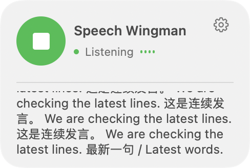

# Speech Wingman

**Speak naturally. Get a nudge when your words match your own rules.**

Speech Wingman is a private speech companion for your Mac. Tell it what to watch for in plain language, click the floating microphone, and speak. When a rule matches, it shows a short reminder with the words that triggered it—useful for meeting practice, interview rehearsals, and communication habits you want to improve.

**Your rules · Multilingual (English, Chinese, Japanese, Korean—even Cantonese) · Fully offline on your Mac**

[](https://github.com/AmethystineAlpaca/speech-wingman/actions/workflows/core-checks.yml)

**[See it in action](#a-small-reminder-for-better-conversations) · [Build and try it](#getting-started) · [中文](docs/README.zh-CN.md) · [日本語](docs/README.ja.md) · [한국어](docs/README.ko.md) · [廣東話](docs/README.zh-HK.md)**

*Open-source developer preview · Apple Silicon · macOS 14+ · Build required; no ready-to-install download yet.*

## Why Speech Wingman?

| What matters | What you get |
| --- | --- |
| **Remember what you want to change** | Write your own triggers and exceptions in everyday language. Each line is an independent rule; an accepted match gives you a quote and a short suggestion. |
| **Speak in your own language** | English, Chinese, Japanese, Korean, and Cantonese—even alternating within a conversation. No recognition-language switch; reminders use your selected interface and alert language (English by default, Chinese, Japanese, or Korean). |
| **Keep your speech private** | Recognition and AI checks run locally. The app and its helpers use macOS App Sandbox without network permissions. No account, API key, or automatic audio/transcript saving. |
| **Stay in the conversation** | A floating microphone and live transcript keep controls close. Pause, resume, mute, or clear the session when you choose. |

## A small reminder for better conversations

Trying to avoid personal digs? Give yourself a rule: **“if i say bad thing about Tom, alert me in English”**.

In this actual example, the app transcribed **“Yeah, Tom is a very mean person. In my opinion.”** and displayed an English reminder suggesting more constructive or neutral wording.


*Actual use of the earlier 0.2.1 interface.*

## Multilingual. One conversation. No language switch.

**English, Chinese, Japanese, Korean—even Cantonese.** Alternate languages in the same listening session. The interface and reminders stay in your chosen language; recognized speech and verbatim quotes keep their original wording.

The rule in this new recording is **“Alert when the speaker mentions a banana, in any language.”** One continuous audio track moves through all five languages, then switches between them again with natural pauses. Recognition stays on automatic throughout; reminders stay in English.


### Switching languages mid-conversation


**[Watch the full video with audio](docs/assets/multilingual-continuous.mp4)** · [Actual transcripts and decisions](docs/assets/multilingual-report.json) · [Reproduce the recording](Tests/MultilingualDemo/README.md)

*Recorded from the production recognition, evaluation, controller, and UI code, using fictional macOS-generated voices fed at normal speed in place of the microphone. These are real model outputs, not scripted alert states. The video includes the original synthetic audio; GIFs are silent. This is a development demonstration, not a live-speaker accuracy benchmark.*

**Natural pauses help.** Rapid switching inside one uninterrupted utterance can omit or distort words. The [250 ms pause stress-test output](docs/assets/multilingual-rapid-stress.json) retains that failure; support for multiple languages does not mean every mixed sentence is transcribed perfectly.

[More rule ideas and the UI gallery](docs/examples.md)

<table>
<tr><td><strong>One click to start</strong></td><td><strong>Live text as you speak</strong></td></tr>
<tr><td></td><td></td></tr>
</table>

*Current 0.4.0 views rendered with synthetic state; these two images demonstrate the UI.*

## Evidence you can inspect

- **About 1 second to first transcript preview** in short local audio tests on an Apple M4 / 16 GB Mac, with models loaded. Rule reminders take additional time after speech finalizes.
- **20 core test groups pass.** The separate earlier model regression run passed **63/73 cases**; known failures remain in the published results.
- **12 bilingual rules, one continuous 11-minute-26-second recording.** The [Ultimate Test Case](Samples/UltimateTestCase/README.md) publishes the scenario, replay tools, raw results, and every evaluation iteration.

These are development fixtures, not general accuracy guarantees. In the long-input replay, the current High mapping detected **12 of 15 positive windows (80% recall)** with **80% precision**; median simulated reminder delay was **21.05 seconds** after the last ASR final. Those figures reclassify recorded runs and exclude live ASR computation. [Full accuracy, timing, and methodology →](docs/validation.md#measured-accuracy-and-latency)

## Getting started

You need an **Apple Silicon Mac with macOS 14+**, Swift 6+, Apple Command Line Tools or Xcode, Git, and ARM64 Python 3.9+ with pip. **16 GB memory and 10 GB free disk** are recommended. The bootstrap script installs a compatible CMake; initial setup downloads dependencies and models.

```bash
git clone https://github.com/AmethystineAlpaca/speech-wingman.git
cd speech-wingman
WINGMAN_PYTHON="$(command -v python3)" bash Scripts/bootstrap-dev.sh
python3 Scripts/setup-model.py
bash Scripts/build-app.sh
open 'build/Speech Wingman.app'
```

Then open **Settings**, write one rule per line, click **Save and apply**, and click the floating microphone. Grant microphone access when prompted. For a simple first rule, try:

```text
Alert if I speak badly of Tom; stay quiet when I praise him.
Alert when I say banana.
```

The completed app runs offline and is locally signed, not notarized. **[Full setup instructions](docs/guide.md#getting-started) · [Updating an existing build](docs/guide.md#updating-an-existing-build) · [Rules and session controls](docs/guide.md#2-set-your-rule)**

## Know before you use it

This is preview software: recognition and rule checks can miss or misinterpret speech, and long statements or many rules can delay reminders. It checks the current statement with limited continuation context. All voices picked up by the microphone can affect results; it does not identify speakers. Sessions stay in memory unless you explicitly export them.

[Limitations](docs/guide.md#limitations) · [Privacy details](docs/guide.md#privacy) · [Known failures](docs/validation.md)

## Documentation and updates

| Looking for… | Read |
| --- | --- |
| Installation, requirements, rules, controls, and privacy | [Build and usage guide](docs/guide.md) |
| Rule inspiration and more screenshots | [Examples and app gallery](docs/examples.md) |
| Localized introductions | [中文](docs/README.zh-CN.md) · [日本語](docs/README.ja.md) · [한국어](docs/README.ko.md) · [廣東話](docs/README.zh-HK.md) |
| Accuracy, latency, and reproducible evidence | [Validation](docs/validation.md) · [Ultimate evaluation](Samples/UltimateTestCase/EVALUATION.md) |
| The local inference pipeline and developer checks | [Architecture](docs/architecture.md) · [Development](docs/development.md) |
| What changed | [Changelog](CHANGELOG.md) · [0.4.0 release notes](docs/release-notes-0.4.0.md) |

**Latest: 0.4.0** adds floating live text, improved continuous-speech handling, and calibrated sensitivity. [Source preview and evaluation archive →](https://github.com/AmethystineAlpaca/speech-wingman/releases/tag/v0.4.0)

## Join in

Share an alert recipe or a fictional example in [Discussions](https://github.com/AmethystineAlpaca/speech-wingman/discussions), [report a bug](https://github.com/AmethystineAlpaca/speech-wingman/issues/new/choose), or read the [contribution guide](CONTRIBUTING.md). Examples in any supported language are welcome. If you find it useful, star the project or watch Releases for updates.

## License

The application source is MIT licensed. Third-party code and models retain their own licenses; SenseVoiceSmall uses the **FunASR Model Open Source License Agreement**. See [third-party notices](THIRD_PARTY_NOTICES.md) before redistributing a packaged app.
