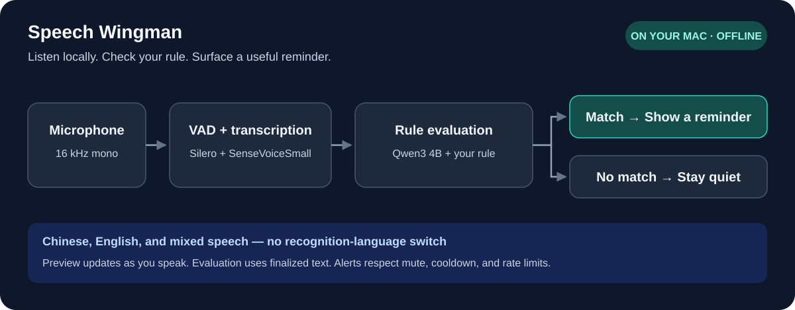
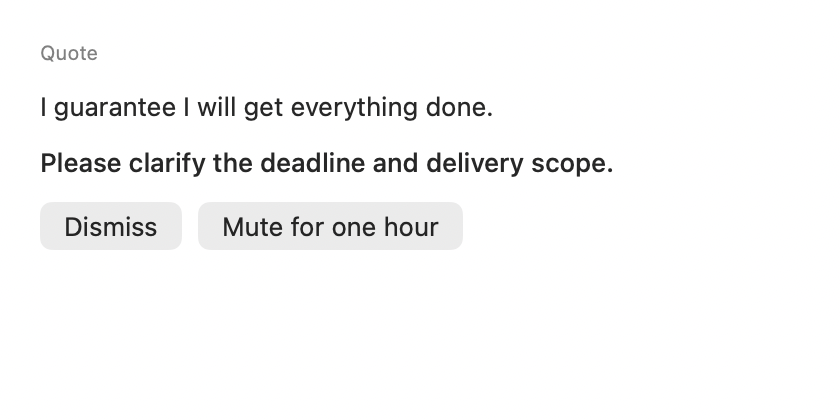
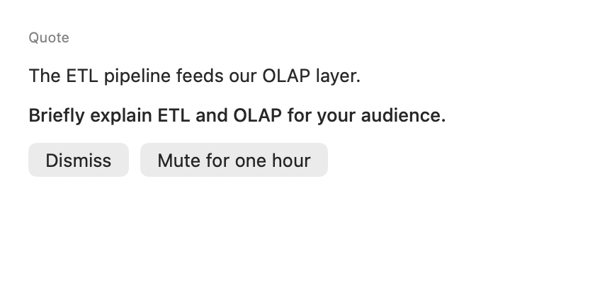
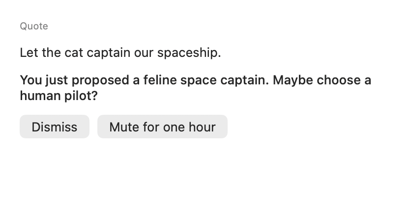
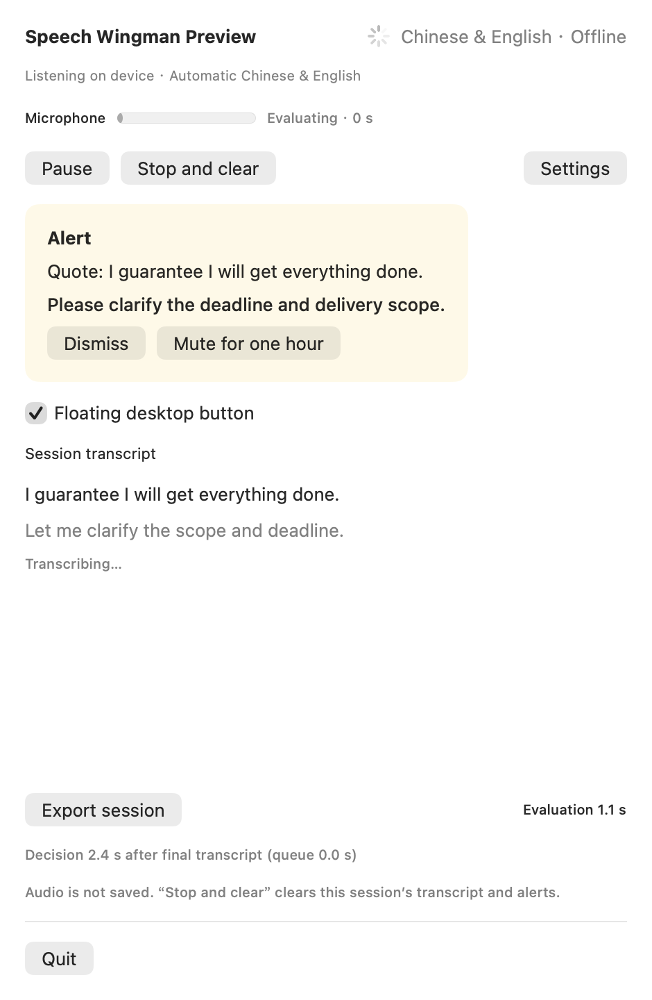
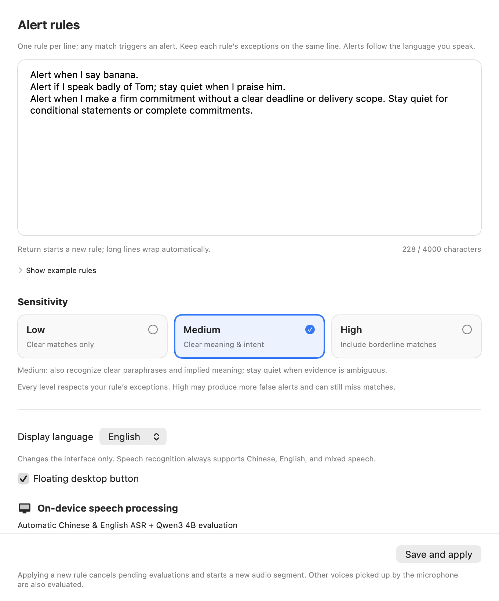

# Speech Wingman

[](https://github.com/AmethystineAlpaca/speech-wingman/actions/workflows/core-checks.yml)

**[Try the source preview](https://github.com/AmethystineAlpaca/speech-wingman/releases/tag/v0.2.1) · [Share an alert recipe](https://github.com/AmethystineAlpaca/speech-wingman/discussions) · [Report a bug](https://github.com/AmethystineAlpaca/speech-wingman/issues/new/choose)**

**Fast speech previews. Chinese + English in one conversation. Useful reminders, entirely on your Mac.**

Speak Chinese, English, or a mix of both. Speech Wingman transcribes microphone audio on your Mac, evaluates finalized text with a local language model, and shows a short reminder when your rule matches. Otherwise, it stays quiet.

**English UI by default · 中文界面可选 · Apple Silicon · No cloud inference**

[Getting started](#getting-started) · [Requirements](#requirements) · [How it works](#how-it-works) · [Limitations](#limitations) · [中文介绍](#中文介绍)

## Why Speech Wingman?

| Highlight | What you get |
| --- | --- |
| **Fast feedback** | First transcript preview in about **1 second** in short local tests; evaluation runs separately from the visible transcript |
| **Quick local judgments** | Short-clip decisions typically arrived **1.5–3.3 seconds after speech ended**, without a cloud round trip |
| **Chinese + English, mixed naturally** | Speak either language or mix them within the same conversation; no recognition-language switch |
| **Your own alert rulebook** | Serious, niche, or wonderfully odd: describe custom triggers and exceptions in natural language. Combine several conditions in one policy |
| **Evidence you can inspect** | Each accepted alert includes a quote from the actual transcript and a short suggestion; malformed responses are rejected |
| **Promising early results** | **13 of 14 synthetic regression cases** matched expected decisions in a local run; known failures remain documented |
| **Private by design** | On-device audio and inference, no runtime account or API key, and explicit session export |
| **Quiet by default** | No alert unless the rule matches and alert controls allow it; pause, mute, or clear at any time |

*Measurements are from small synthetic clips on an Apple M4 / 16 GB Mac, with models already loaded. They are not a general accuracy benchmark or a latency guarantee. Long uninterrupted speech can delay alerts; see [limitations](#limitations).*



> **Preview software.** This is a working local prototype, not a guarantee that every relevant statement will be detected. Transcription previews update while you speak; semantic evaluation currently uses finalized segments. Long uninterrupted speech can delay alerts.


## Your rules can be practical. Or delightfully specific.

A small local language model evaluates meaning, so you can describe situations beyond a fixed list of built-in alerts. Use Chinese or English, add exceptions, and combine several conditions in the same policy. Recognition and reasoning still have limits; these examples are starting points to test.

### 1. The scope guardian

**Use it for:** meetings, planning, or sales practice.

> Alert when I make a firm commitment without a clear deadline or delivery scope. Stay quiet for conditional statements and commitments that already specify both.

**Example:** “I guarantee I will get everything done.” → a reminder to clarify the deadline and scope.



### 2. The jargon bouncer

**Use it for:** explaining technical work to a nontechnical audience.

> Alert when I use a technical acronym without explaining it in the current statement or recent context. Stay quiet if I already gave a plain-language explanation.

**Example:** “The ETL pipeline feeds our OLAP layer.” → a reminder to explain the acronyms.



### 3. The space-cat alarm

**Use it for:** a playful demo of an unusually specific rule.

> Alert when I seriously propose putting a cat in charge of a spaceship. Ignore negations, quotations, and descriptions of a fictional story.

**Example:** “Let the cat captain our spaceship.” → a very specific reminder about your proposed crew.



*All three pictures show actual app views populated with fictional demonstration data. They illustrate possible rules and presentation, not verified model responses to those examples.*

### Several triggers, one policy

For example, you can combine the practical rules:

> Alert if any of these happen: (1) I make a firm commitment without a deadline or delivery scope; (2) I use an unexplained technical acronym. Do not alert for conditional commitments, complete commitments, or acronyms explained in recent context. Give one short suggestion for the matching condition.

The current interface has one policy editor (up to 4,000 characters), not independent switches for multiple saved alerts. Multiple conditions share the same sensitivity, mute state, cooldown, and rate limit. Clear, focused rules are easier to validate than a long list of conflicting conditions.

## What you can use it for

- **Meeting and presentation practice:** notice a firm promise that leaves the deadline or delivery scope unclear.
- **Communication coaching:** ask for a reminder when your wording matches a behavior you are trying to improve.
- **Technical explanations:** experiment with rules about unexplained jargon or audience-specific terminology.
- **Private rehearsal:** review a pitch or interview answer without uploading speech to a service.

These are example rules to try, not individually certified capabilities. You describe the behavior in natural language, including exceptions. One natural-language policy is active at a time. That policy can combine several triggers and exceptions; it is not limited to a built-in category list. There is currently one policy editor, rather than separate per-rule switches.

## Features

- **Local inference:** Silero VAD, SenseVoiceSmall ASR, and a quantized Qwen3 4B text model run on the Mac. No runtime API key, account, model download, or cloud fallback.
- **Automatic bilingual speech recognition:** Chinese, English, and mixed speech use the same recognizer. Switching the interface language does not change recognition.
- **A live transcript:** the current preview is replaced as recognition improves; finalized segments enter the session history.
- **Contextual alerts:** short recent context helps evaluate your rule. Alert quotes must occur verbatim in the ASR text; malformed model output is rejected.
- **A quiet menu-bar app:** start manually, pause/resume, dismiss an alert, mute for an hour, or stop and clear the session.
- **English and Chinese UI:** select **Settings → Display language → English / 中文**. The change is immediate and saved across launches.
- **Explicit export:** export the current session to JSON only when you choose to. Audio is not recorded to a file by the app.

## A look at the app

The following images render the actual app views with **fictional English demonstration content**. They are not recordings, saved preferences, or measured model outputs.

<table>
<tr><td width="50%"><strong>Session and reminder</strong></td><td width="50%"><strong>Settings</strong></td></tr>
<tr><td></td><td></td></tr>
</table>

<details>
<summary>Floating reminder</summary>


</details>

## Requirements

| Item | Requirement / guidance |
| --- | --- |
| Platform | Apple Silicon Mac; Intel Macs, Windows, and Linux are not supported by this build |
| macOS | Deployment target: macOS 14 or later; current local verification was on macOS 27 |
| Memory | 16 GB unified memory recommended; lower-memory machines have not been validated |
| Storage | Models are about 2.74 GB; the generated app is about 2.78 GB. Allow at least 10 GB free for downloads, dependencies, build outputs, and the app |
| Developer tools | Swift 6+, Apple Command Line Tools or Xcode, Git, Python 3.9+, and an ARM64-compatible CMake |
| Microphone | An available microphone and macOS microphone permission |
| Network | Needed for the initial source/dependency/model downloads; normal app operation is offline |

The test machine was an Apple M4 Mac with 16 GB memory. This is a tested configuration, not a promise of the same latency on every Apple Silicon Mac. The Python scripts are build/evaluation tools; Python is not needed to run the completed app.

## Getting started

This repository distributes **source code and pinned dependency/model manifests**, not model weights or a notarized installer.

### 1. Prepare the toolchain

Install Apple's Command Line Tools if needed:

```bash
xcode-select --install
```

Verify that `swift --version` reports Swift 6 or later. Use an ARM64 Python 3 with `pip` available; replace `python3` below with its path if necessary.

```bash
git clone https://github.com/AmethystineAlpaca/speech-wingman.git
cd speech-wingman

# Download pinned build tools and ASR libraries; build the native workers.
WINGMAN_PYTHON="$(command -v python3)" bash Scripts/bootstrap-dev.sh

# Download and SHA-256-verify the model resources.
python3 Scripts/setup-model.py

# Build the Swift app, package models/libraries, and sign the local bundle.
bash Scripts/build-app.sh
open 'build/Speech Wingman.app'
```

`bootstrap-dev.sh` installs a pinned CMake into the project-local `.tools/` directory. Alternatively, set `WINGMAN_CMAKE` to an existing compatible CMake executable, run `python3 Scripts/setup-asr-runtime.py`, and then build. The native build pins its llama.cpp revision.

The build script replaces the generated app and closes a running Speech Wingman instance. Export any session you want to retain before rebuilding. The app is locally ad hoc signed and **not Developer ID notarized**.

### 2. Set your rule

1. Click the microphone icon in the macOS menu bar.
2. Open **Settings** and describe when to alert, including when to stay quiet. Rules may be written in Chinese or English.
3. Choose **Low**, **Medium**, or **High** sensitivity, then **Save and apply**.
4. Select **Start listening** and grant microphone permission when macOS asks.
5. Speak normally. No speech-language selector is required.

Example rule to experiment with:

> Alert when I make a firm commitment without a clear deadline or delivery scope. Stay quiet for conditional statements and commitments that already specify both.

The built-in rule retains its original Chinese text. The display-language switch translates interface controls, not user-authored rules, transcripts, or model-generated suggestions. Translating a rule can change model behavior, so test your own wording.

### 3. Control the session

- **Pause / Resume:** stop collection and restart local processing when ready.
- **Stop and clear:** stop listening and clear this session's transcript and alerts.
- **Mute for one hour:** suppress reminders while transcription continues.
- **Export session:** save the current transcript and alerts as JSON to a location you choose.
- **Save and apply:** applying a rule while listening cancels old work and starts a new audio segment.

All voices picked up by the microphone can affect the result. The app does not identify speakers or separate your voice from other people in the room.

## How it works

1. **Audio capture:** AVAudioEngine provides microphone audio, converted to 16 kHz mono.
2. **Voice activity detection:** Silero VAD identifies speech and silence.
3. **Transcription:** SenseVoiceSmall runs through sherpa-onnx/ONNX Runtime on CPU. The active short window is re-decoded roughly once a second; this is incremental previewing around a non-streaming ASR model.
4. **Semantic evaluation:** finalized text, recent context, and your rule are sent to Qwen3-4B-Instruct-2507 (Q4_K_M), using llama.cpp with Metal acceleration.
5. **Validation and alert controls:** a constrained JSON response is validated; matching evidence may produce a floating reminder, subject to mute, deduplication, and rate limits.

There is no runtime HTTP service or cloud fallback. Source, model revisions, sizes, and SHA-256 hashes are recorded in `Models/manifest-*.json` and `Resources/asr-runtime.json`.

[Architecture details](docs/architecture.md) · [Validation and known failures](docs/validation.md)

## Privacy

- Microphone audio and the live session stay in local process memory during normal operation; the app does not write audio files or automatically save session transcripts.
- Alert rules, sensitivity, and display-language preferences are stored locally in macOS preferences.
- A session export writes potentially sensitive transcript content to your chosen location. Share it deliberately.
- The app and its packaged helper processes use App Sandbox without client/server network entitlements. Dependency/model downloads happen in separate developer setup scripts.
- This source repository excludes local recordings, session exports, evaluation logs, user preferences, downloaded models, native binaries, and machine-specific development notes.

These statements describe the app's behavior. They do not claim to control macOS services, backups, diagnostics, or memory management.

## Limitations

- **Near-real-time previews, segment-based judgments.** Silence of roughly 650 ms normally finalizes a segment. Long speech is bounded into approximately 12–15 second windows; continued speech can postpone or cause re-evaluation of an alert. This is not continuous word-by-word semantic detection.
- **Recognition and reasoning can be wrong.** Product names, accents, overlapping voices, negation, rule translations, and complex exceptions are imperfect. A mixed-language “alert on any English word” example is a known semantic miss.
- **Alerts are rate-limited:** the current default is a 30-second cooldown and at most three alerts in ten minutes. Muted, repeated, or rate-limited matches do not pop up.
- **Session limits:** the UI retains up to 1,000 finalized segments. Excessive classification backlog stops listening with an error instead of growing indefinitely.
- **Small synthetic evaluation only:** 8/8 existing cases and 5/6 additional cases matched expected decisions in one local replay run. This is a development regression check, not a representative accuracy score.

In the short synthetic replay set, the first preview typically appeared in about one second; judgments often arrived roughly 1.5–3.3 seconds after the audio ended. Timing depends on audio, rule, hardware, and system load. Startup/model-loading time is separate.

## Development and checks

```bash
# Core logic and worker lifecycle checks (no model download required)
swift run WingmanCoreTests

# Programmatic English/Chinese UI state and rendering checks (desktop session required)
bash Scripts/check-ui-language.sh

# Check runtime source, native symbols, sandbox entitlements, and packaged signatures
bash Scripts/audit-offline.sh

# Generate fictional speech fixtures using already-installed macOS voices
python3 Scripts/generate-fixtures.py

# Replay synthetic audio at microphone speed with network access denied
python3 Scripts/evaluate-streaming.py --realtime
python3 Scripts/evaluate-streaming.py --realtime --cases Tests/Evaluation/heldout.json

# Verify the actual bundled workers under an App Sandbox parent
bash Scripts/evaluate-bundle.sh
```

Build the app before model-based checks. Fixture generation needs installed English and Chinese macOS voices; it does not ship audio or download voices. Generated audio/results go to ignored `local-evaluation/`. The additional-case suite includes a known failure and can exit nonzero; voice versions can also change results. The UI checks use an isolated preferences domain and fictional content, not your microphone.

The offline evaluation CLI accepts an audio file and a UTF-8 policy file:

```bash
.build/release/wingman-evaluate \
  build/native/bin/text-worker build/native/bin/asr-worker Models \
  /path/to/recording.wav /path/to/policy.txt --realtime
```

It accepts up to five minutes of audio and evaluates the combined transcript after playback. Combined text exceeding 4,000 characters is rejected; the menu-bar app evaluates segments instead.

| Directory | Purpose |
| --- | --- |
| `Sources/WingmanApp` | SwiftUI/AppKit interface, microphone capture, session coordination |
| `Sources/WingmanCore` | Worker protocols, output validation, alert controls, display strings |
| `Native` | C++ ASR and text-inference workers |
| `Models` / `Resources` | Pinned manifests, licenses, app metadata, sandbox entitlements |
| `Scripts` | Reproducible setup, build, evaluation, and publication checks |
| `Tests` | Core checks, UI rendering harness, fictional evaluation definitions |

## Join in

Trying it on your Mac? Share your setup and a fictional example in [Discussions](https://github.com/AmethystineAlpaca/speech-wingman/discussions). English and Chinese are welcome. Useful alert recipes, compatibility reports, and reproducible failures help improve the app.

If this project is useful to you, a GitHub star helps others discover it. Watch **Releases** for version announcements. Read the [contribution guide](CONTRIBUTING.md) and [changelog](CHANGELOG.md) before contributing.

## License

The application source is MIT licensed. Third-party code and model weights keep their own licenses: Qwen3 is Apache 2.0; the original SenseVoiceSmall weights use the **FunASR Model Open Source License Agreement**, not the application's MIT license; Silero VAD is MIT. Read [THIRD_PARTY_NOTICES.md](THIRD_PARTY_NOTICES.md) and the included model licenses before using or redistributing a packaged app.

---

## 中文介绍

**Speech Wingman 是一个完全在本机处理语音的 macOS 菜单栏提醒助手。** 它会转录麦克风听到的发言，用本地小语言模型判断是否符合你写下的提醒条件。命中条件且未被静音、去重或限流时弹出简短建议；其他情况下保持安静。

### 快速反馈，中英自然混说

短句本地测试中，**约 1 秒出现转录预览**，通常在**说完后约 1.5–3.3 秒完成判断**。你可以说中文、英文，也可以在同一段话里混用两种语言，不需要切换识别模式。提醒依据自然语言规则和上下文，引用实际转录中的原话，并给出简短建议。

目前 **14 条合成语音回归用例中有 13 条判断符合预期**。这是有明确范围的早期结果，不代表真实场景准确率保证；已知漏报仍公开记录。所有数字来自 Apple M4 / 16 GB、本地模型已加载后的短句测试，长发言可能有更长延迟。

### 规则可以很实用，也可以很有脑洞

本地小语言模型按语义判断，不局限于固定提醒类别。你可以尝试：

1. **承诺守门员：** 明确保证会完成，却没有说明截止时间或交付范围时提醒；条件承诺和信息完整的承诺不提醒。
2. **术语检查员：** 面向非技术听众，使用了未解释的技术缩写时提醒；近期已经解释过的词不提醒。
3. **宇宙猫船长警报：** 认真提议让猫驾驶宇宙飞船时提醒；否定、引用和虚构故事不提醒。

也可以把多项触发条件组合在同一段规则里，例如“缺少时间范围的承诺，或者未解释的术语，任一出现就提醒”。当前是一个最多 4,000 字的规则编辑框，多项条件共用敏感度、静音与提醒限流；没有多个独立开关的规则管理器。上述英文图示使用虚构内容展示界面，并非这些例子的模型准确性证明。

### 适用场景与特点

可用于会议、演讲、面试和销售沟通练习，例如提醒自己补充承诺的截止时间与交付范围，或检查是否使用了需要解释的术语。这些是可尝试的规则，不是保证准确的预设能力。

- **运行完全离线：** 模型随本机构建的应用打包，不需要账号、API key 或云端服务。首次下载源码、依赖和模型需要联网。
- **中文、英文及中英混合自动识别：** 不需要手动切换录音语言。界面默认英文，可在 **Settings → Display language → 中文** 切换并保存。
- **自然语言规则：** 写清楚何时提醒、哪些情况应保持安静，一次启用一条规则。界面语言切换不会翻译原有规则、转录或生成的建议。
- **可控的会话：** 手动开始、暂停/继续、停止并清空、静音一小时，或主动导出 JSON。应用不默认保存录音或转录。

### 系统要求与安装

需要 **Apple Silicon Mac、macOS 14+、Swift 6+、Apple 开发工具、Python 3.9+ 和兼容 ARM64 的 CMake**。建议 16 GB 统一内存、至少 10 GB 可用磁盘空间。当前验证环境为 Apple M4 / 16 GB / macOS 27，较老系统及更低内存配置尚未全面验证。

本仓库发布源码和固定版本的下载清单，不包含模型权重或公证安装包。按上方 **Getting started** 命令克隆仓库、运行 `bootstrap-dev.sh`、下载模型，再执行 `build-app.sh`。生成的应用约 2.78 GB，使用本机 ad hoc 签名，未做 Developer ID 公证。

打开应用后，点击菜单栏麦克风图标，在设置中填写提醒条件，保存后点击 **Start listening / 开始监听**，并允许麦克风访问。麦克风拾取到的其他人声也会参与判断，应用不区分说话人。停止会清空当前会话；如需保留，请先主动导出。

### 工作方式与边界

处理链路为 **Silero VAD → SenseVoiceSmall 转录 → Qwen3 4B 文本判断**。当前预览约每秒更新，约 650 ms 静音后定稿；语义判断处理定稿片段。连续长发言会按约 12–15 秒窗口处理，继续说话也可能延后提醒，因此不承诺逐字即时判断。

默认提醒冷却时间为 30 秒，十分钟最多三条。专有名词、口音、多人重叠、复杂规则和中英混合都可能出现错误。小规模合成语音回放中，基础组 8/8、补充组 5/6 符合预期；仍存在“中文中出现英文词就提醒”的漏报，不能把这一结果当作真实场景准确率。

应用源码采用 MIT；模型和依赖适用各自许可证，尤其 SenseVoiceSmall 使用 FunASR 模型协议。详细依赖许可、架构和测试方法见上方英文说明及对应文档。页面中的配图均为英文虚构演示内容，不包含真实录音、用户偏好或个人资料。
