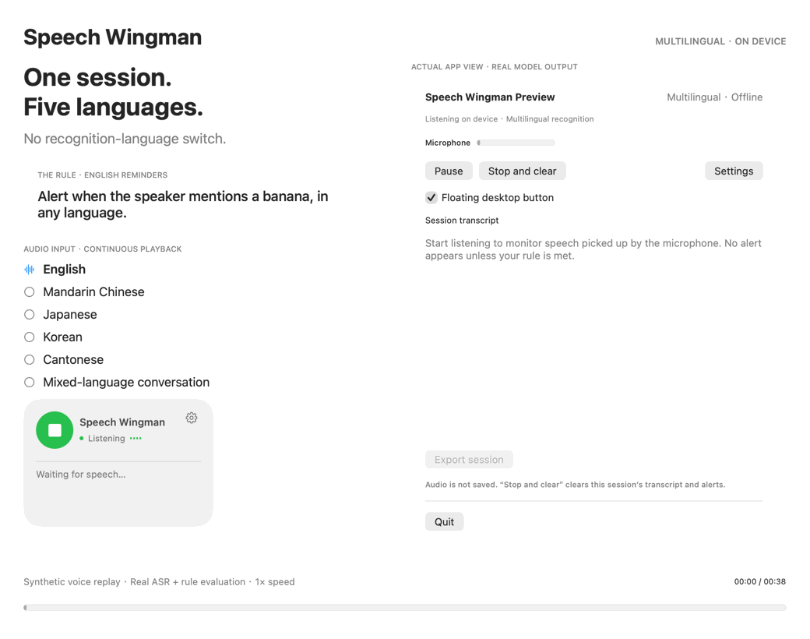
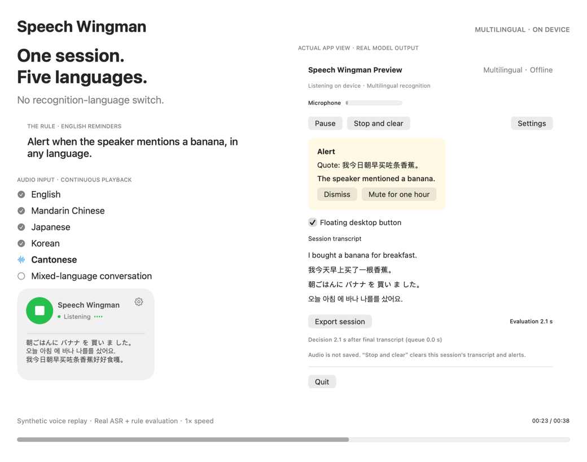

# Speech Wingman

**自然に話す。自分で決めたルールに合ったときだけ、短い通知を。**

Mac上で動く音声リマインダーです。普段の言葉でルールを書き、フローティングマイクをクリックして話すと、該当する発言を引用して通知します。会議、面接、プレゼンテーションの練習に使えます。

**Multilingual（英語・中国語・日本語・韓国語、さらに広東語）· 会話中の言語切り替え · 完全オフライン**

[English](../README.md) · [中文](README.zh-CN.md) · [한국어](README.ko.md) · [廣東話](README.zh-HK.md)

*オープンソースの開発プレビュー · Apple Silicon · macOS 14以降 · 現在はローカルビルドが必要です。*

## 5つの言語を、1つのセッションで

今回のルールは「どの言語でも、バナナに言及したら通知する」。英語、中国語、日本語、韓国語、広東語を1本の音声で順番に話し、その後、自然な間を置いて再び切り替えます。認識言語の設定は変更していません。通知は選択した英語のままです。

### 会話の途中でも言語を切り替える

[音声付きの全編動画](assets/multilingual-continuous.mp4) · [文字起こしと判定の生データ](assets/multilingual-report.json) · [再現手順](../Tests/MultilingualDemo/README.md)

*架空の内容をmacOS音声合成で作成し、通常速度で実際の認識・判定・セッション制御・画面コードに入力しました。マイク入力のみ音声再生に置き換えています。文字起こしや通知は事前に用意した回答ではなく、実際のモデル出力です。動画には元の合成音声があり、GIFは無音です。実際の話者によるマイク精度の評価ではありません。*

自然な間を置くと認識しやすくなります。1つの発話内で急速に切り替えると、語句が抜けたり誤認識されたりする場合があります。[250ミリ秒間隔の負荷テスト](assets/multilingual-rapid-stress.json)では、その失敗も公開しています。

## 主な機能

- **自分のルール：** 1行に1つの条件と例外を記述。いずれかに一致すると通知します。
- **多言語の自動認識：** 英語、中国語、日本語、韓国語、広東語に対応。会話中に言語を変更しても、認識設定の切り替えは不要です。
- **表示・通知の言語：** 既定は英語。英語・中国語・日本語・韓国語から選択でき、設定は保存されます。広東語は音声入力に対応しますが、独立した画面言語ではありません。
- **プライバシー：** 認識と判定はMac上で実行。アプリと補助プロセスにはネットワーク権限がありません。音声や文字起こしは自動保存されません。
- **操作：** フローティングボタン、リアルタイム文字起こし、一時停止・再開、1時間ミュート、停止して消去、明示的なセッション書き出し。

自分で書いたルール、文字起こし、引用は原文を保持します。新しい通知は選択した言語で生成されます。ルールの合計は4000文字までです。

## ビルドして試す

Apple Silicon Mac、macOS 14以降、Swift 6以降、Apple Command Line ToolsまたはXcode、Git、ARM64版Python 3.9以降が必要です。メモリ16GBと空き容量10GBを推奨します。初回の依存関係・モデル取得にはインターネット接続が必要ですが、完成したアプリはオフラインで動作します。

[ビルド手順](guide.md#getting-started)に従い、設定でルールを保存して音声入力を開始してください。日本語表示は **Settings → Interface and alert language → 日本語** から選べます。アプリはローカル署名で、Developer IDによる公証済み配布版ではありません。

## 検証と制限

20グループのコアテストが成功しています。別途実施した以前のモデル回帰テストは63/73件成功で、失敗も残しています。[検証記録](validation.md)と[長時間テスト](../Samples/UltimateTestCase/README.md)を参照してください。

音声認識やルール判定は完全ではありません。固有名詞、なまり、複数人の声、速い言語切り替え、長い発言では誤りや遅延が生じます。話者の識別は行いません。

アプリのソースコードはMITライセンスです。モデルと依存関係にはそれぞれのライセンスが適用されます。[第三者ライセンス](../THIRD_PARTY_NOTICES.md)をご確認ください。
