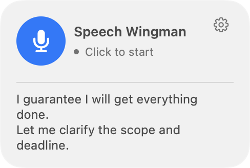

# Rule examples and app gallery

[README](../README.md) · [Build and usage guide](guide.md)

## Chinese. English. Both in the same sentence.

**No recognition-language switch. No need to stick to one language.** Speak Chinese, English, or switch between them naturally—even within a sentence. The display language is a separate setting.

These complete, uncropped screenshots record actual use of the earlier 0.2.1 interface, showing settings and a floating alert together. They are retained as observed bilingual examples; the current 0.4.0 controls are shown below. The visible images are unchanged; only embedded metadata was removed.

### English speech → an English reminder

**Rule:** “if i say bad thing about Tom, alert me in English”

The app transcribed “Yeah, Tom is a very mean person. In my opinion.” and suggested more constructive or neutral wording, in English.

### English rule → Chinese + English mixed speech

**Rule:** “if i mentioned banana, alert me”

The quote reads “香蕉的英文叫做banana，你知道吗?”—Chinese and English in the same sentence. The English rule triggered a reminder with a Chinese suggestion, while the interface remained in English.

*These are two observed examples, separate from the illustrative demos below. See [validation](../docs/validation.md) for measured results and known misses.*

## Your rules can be practical. Or delightfully specific.

A small local language model evaluates meaning, so you can describe situations beyond a fixed list of built-in alerts. Use Chinese or English and put each rule, with its exceptions, on its own line. Recognition and reasoning still have limits; these examples are starting points to test.

### 1. The scope guardian

**Use it for:** meetings, planning, or sales practice.

> Alert when I make a firm commitment without a clear deadline or delivery scope. Stay quiet for conditional statements and commitments that already specify both.

**Example:** “I guarantee I will get everything done.” → a reminder to clarify the deadline and scope.

### 2. The jargon bouncer

**Use it for:** explaining technical work to a nontechnical audience.

> Alert when I use a technical acronym without explaining it in the current statement. Stay quiet if the current statement includes a plain-language explanation.

**Example:** “The ETL pipeline feeds our OLAP layer.” → a reminder to explain the acronyms.

### 3. The space-cat alarm

**Use it for:** a playful demo of an unusually specific rule.

> Alert when I seriously propose putting a cat in charge of a spaceship. Ignore negations, quotations, and descriptions of a fictional story.

**Example:** “Let the cat captain our spaceship.” → a very specific reminder about your proposed crew.

*All three pictures show actual app views populated with fictional demonstration data. They illustrate possible rules and presentation, not verified model responses to those examples.*

## What you can use it for

- **Meeting and presentation practice:** notice a firm promise that leaves the deadline or delivery scope unclear.
- **Communication coaching:** ask for a reminder when your wording matches a behavior you are trying to improve.
- **Technical explanations:** experiment with rules about unexplained jargon or audience-specific terminology.
- **Private rehearsal:** review a pitch or interview answer without uploading speech to a service.

These are example rules to try, not individually certified capabilities. You describe the behavior in natural language, including exceptions. Each nonempty line is an independent rule; rules are not limited to a built-in category list. There is one editor, without separate per-rule switches.

## Floating desktop control

<table>
<tr><td><strong>Ready to listen</strong></td><td><strong>Listening · click to stop</strong></td></tr>
<tr><td></td><td></td></tr>
<tr><td><strong>Paused · transcript retained</strong></td><td><strong>Long speech · follows latest text</strong></td></tr>
<tr><td></td><td></td></tr>
</table>

*These images render the current production UI with synthetic state. See [the current settings and session views](#a-look-at-the-app), [update instructions](guide.md#updating-an-existing-build), and [the changelog](../CHANGELOG.md).*

## A look at the app

The following images render the actual app views with **fictional English demonstration content**. They are not recordings, saved preferences, or measured model outputs.

<table>
<tr><td width="50%"><strong>Session and reminder</strong></td><td width="50%"><strong>Settings</strong></td></tr>
<tr><td></td><td></td></tr>
</table>

Floating reminder

